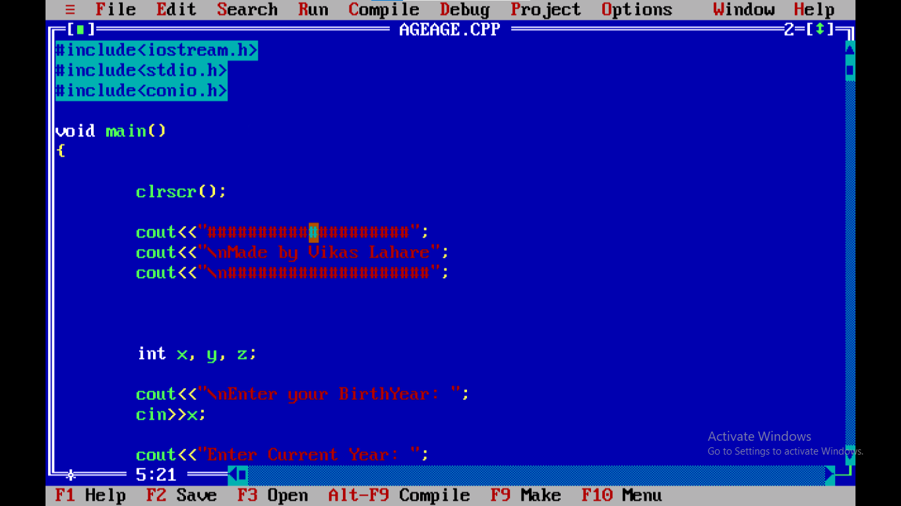
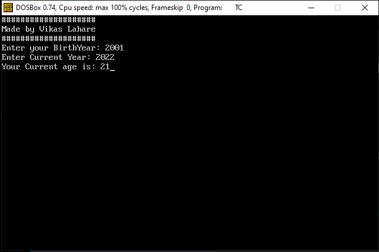
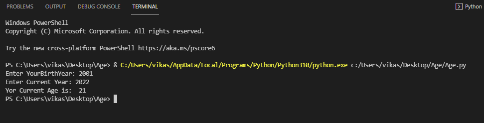

**How to create Simple Age Calculator Using C++ and Python**

1. cd simpleAgeCalculator
2. gcc Age.cpp

**C++** 
screenshot - 1

  

screenshot - 2

   

**Python**

1. cd simpleAgeCalculator
2. python Age.py
3. python2 Age.py
4. python3 Age.py

screenshot - 3
 

Social Links :

for more information Follow links :

|**[Follow me on Instagram](https://instagram.com/__vikas__05)**|
|---------------------------------------------------------------|

|**[Follow me on Linkedin](https://www.linkedin.com/in/vikas-lahare-473144227/)**|
|--------------------------------------------------------------------------------|

|**[Subscribe my youtube channel](https://www.youtube.com/channel/UCf-YDB8E6JJ4eoBTBDKVBNQ)**|
|--------------------------------------------------------------------------------------------|

